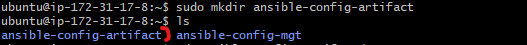
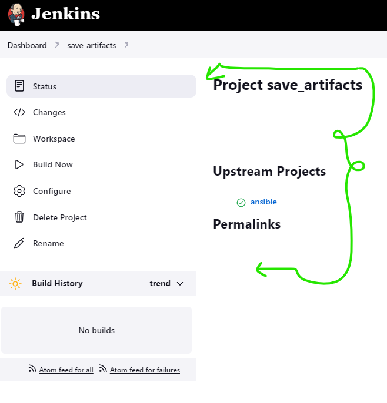

# ANSIBLE REFACTORING AND STATIC ASIGNMENTS (IMPORTS AND ROLES)

In this project we will continue working with **`ansible-config-mgt`** repository and make some improvements to the code. Now we need to

refactor the ansible code, create assignments, and learn how to use the imports functionality. Imports allow to effectively re-use previously

created playbooks in a new playbook. It allows us to organize tasks and reuse them when needed.

# Side Self Study: For better understanding or Ansible Artifcats re-use- [read this article](https://docs.ansible.com/ansible/latest/user_guide/playbooks_reuse.html)

## Code Refactoring

Refactoring is a general term in computer programming. It means making changes to the source code without changing expected behaviour 

of the software.

The main idea of refactoring is to enhance code readability, increase maintainabilityand extensibility, reduce complexity, add proper 

comments without affecting the logic.

In this case, we will move things around a little bit in the code, but the overall state of the infrastructure remians the same.

Let us see how we can improve our Ansible Code!

# Refactor Ansible Code by Importing other playbooks into site.yml

Step 1 - Jenkins Job Enhancement

Before we begin, let us make some changes to our Jenkins job - now every new change in the codes creates a seperate directory

which is not very convenient when we want to run some commands from one place. Besides, it consumes space on Jenkins server with 

each subsequent change. 

Let us enhance it by introducing a new Jenkins project/job - we will require **`copy Artifact`** plugin

1. Go to your **`Jenkins_ansible`** server and create a new directory called **`ansible-config-artifact`** - we will store there 

all artifacts after each build.

**`sudo mkdir /home/ubuntu/ansible-config-artifact`**

2. Change permissions to this directory, so Jenkins could save files there - **`chmod -R 0777 /home/ubuntu/ansible-config-artifact`**

3. Go to the Jenkins web console -> Manage Jenkins -> Manage Plugins -> on Available tab search for Copy Artifact and install this plugin

without restarting Jenkins.

4. Create a new Freestyle project (you have done it in Project 9) and name it **`save_artifacts`**

5. This project will be triggered by completion of your existing **`ansible`** project. Configure it accordingly:

Note: You can configure number of builds to keep in order to save space on the server, for example, you might want to keep only last

2 or 5 build results. You can also make this change to your ansible job.

6. The main idea of **`save_artifacts`** project is to save artifacts into **`/home/ubuntu/ansible-config-artifact`** directory.

To achieve this, create a Build step and choose Copy artifacts from other project, specify ansible as a source project and

**`/home/ubuntu/ansible-config-artifact`** as a target directory.

7. Test your set up by making some change in README.md file inside your ansible-config-mgt repository (right inside main branch).

If both Jenkins jobs have completed one after another - you shall see your files inside **`/home/ubuntu/ansible-config-artifact`**

directory and it will be updated with every commit to your main branch. Now your Jenkins pipeline is more neat and clean.

- NOTE: Now everything done was copied into the **`ansible-config-artifact`**

## REFACTOR ANSIBLE CODE BY IMPORTING OTHER PLAYBOOKS INTO SITE.YML

### Step 2 – Refactor Ansible code by importing other playbooks into site.yml

Before starting to refactor the codes, ensure that you have pulled down the latest code from master (main) branch, and created a 

new branch, name it refactor.

Let see code re-use in action by importing other playbooks.

8.	Within playbooks folder, create a new file and name it site.yml – This file will now be considered as an entry point into the 

entire infrastructure configuration. Other playbooks will be included here as a reference. In other words, `site.yml` will become 

a parent to all other playbooks that will be developed. Including common.yml that you created previously. Dont worry, you will understand

more what this means shortly.

9. Create a new folder in root of the repository and name it static-assignments. The static-assignments folder is where all other children

playbooks will be stored. This is merely for easy organization of your work. It is not an Ansible specific concept, therefore you can choose

how you want to organize your work. You will see why the folder name has a prefix of static very soon. For now, just follow along.

10.	Move common.yml file into the newly created static-assignments folder.

11.	Inside site.yml file, import common.yml playbook.