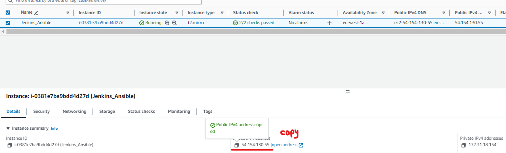
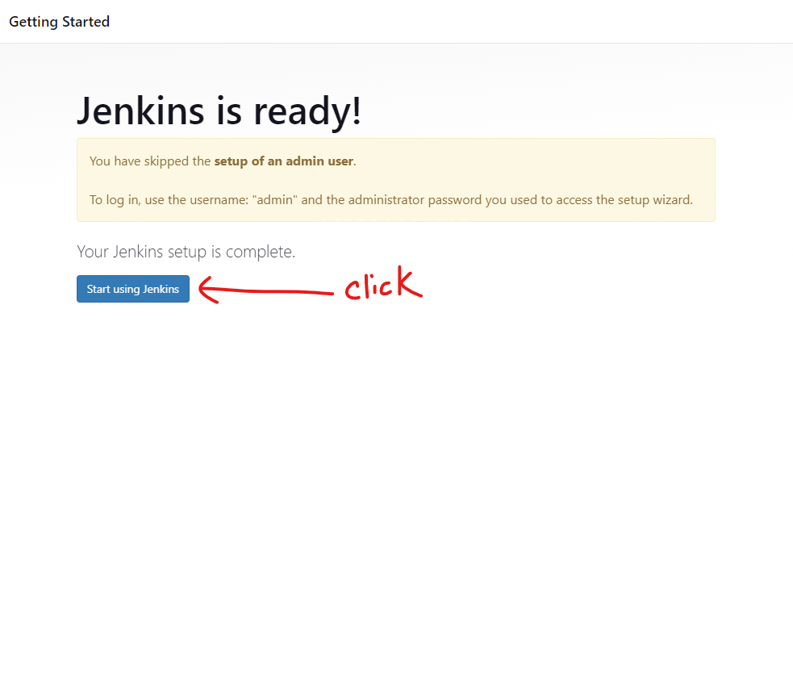

# Ansible Configuration Management 

- In this project we are going to experience the power of automation with Ansible by simplifying complex tasks and streamlining 

an IT infrastructure.

- What is Ansible?

Ansible is an open-source software platform utilized for automating configuration management. It is renowned for its scalability, flexibility, and

ease of use, and is widely used in various industries such as finance, healthcare, and technology. 

In 2015, it was acquired by Red Hat, Inc. and has since become one of the leading automation tools in the market.

It uses YAML, a simple and powerful language for describing automation tasks declaratively, which makes it easy to understand and maintain.

- In the following link Below, Click and read about Ansible, **`it's uses`**, **`How Ansible Works`**, **`Ansible Playbook Example`**

[What is Ansible in DevOps and How it Works](https://kodekloud.com/blog/ansible-in-devops/)

# Ansible Client as a Jump Server (Bastion Host)

- A Jump Server (sometimes also referred as Bastion Host) is an intermediary server through which access to internal network can be provided. 

If you think about the current architecture you are working on, ideally, the webservers would be inside a secured network which cannot be reached 

directly from the Internet. That means, even DevOps engineers cannot SSH into the Web servers directly and can only access it through a Jump Server.

It provide better security and reduces attack surface. On the diagram below the Virtual Private Network (VPC) is divided into two subnets.

Public subnet has public IP addresses and Private subnet is only reachable by private IP addresses.


## TASKS:

- Install and configure Ansible Client to act as a Jump Server/Bastion Host

- Create a simple Ansible playbook to automate servers configuration

# Install and Configure Ansible on EC2 Instance

- Step 1: 

1. Update the **`Name`** tag on your **`Jenkins`** EC2 instance to **`Jenkins_Ansible`**. We will use this server to run playbooks.


- Run **`sudo apt update -y`** to update packages and releases.

- Install Ansible using the command **`sudo apt install ansible`**

- Go to **`Jenkins.io`** and select **`Ubuntu OS`** to install open JDK requirements to install Jenkins [Jenkins Package](https://pkg.jenkins.io/debian/)

- Use this code below:


- Now install the latest Jenkins [Install Jenkins](https://www.jenkins.io/doc/book/installing/linux/)

```sudo wget -O /usr/share/keyrings/jenkins-keyring.asc \
  https://pkg.jenkins.io/debian-stable/jenkins.io-2023.key
echo deb [signed-by=/usr/share/keyrings/jenkins-keyring.asc] \
  https://pkg.jenkins.io/debian-stable binary/ | sudo tee \
  /etc/apt/sources.list.d/jenkins.list > /dev/null
sudo apt-get update
sudo apt-get install jenkins
```
- Let's check the ansible version we running use this command **`ansible --version`**


- And also check the status of the Jenkins **`sudo systemctl status jenkins`** && NOTE: to restart use **sudo systemctl restart jenkins.service`**


- Note, for us to use Jenkins we have to edit inbound rules on the security group. **`Jenkins uses PORT 8080`**


- Now click on the public IP Address and type it like this followed by the port number **`http://54.154.130.55:8080/`**



- Now to unlock Jenkins below after pasting the **`url`** followed by port **`8080`**. Use **`sudo cat /var/lib/jenkins/secrets/initialAdminPassword`**


- Copy the HASH PASSWORD to unlock Jenkins.


- Click to install Suggested Plugins


2. In your GitHub account create a new repository and name it **`ansible-config-mgt`**


- Now let's initialize a git repo where we have **`ansible-config-mgt`**, remember to open it with **`VSCODE`** and run the following command below:

```$ echo "# ansible-config-mgt" >> README.md
git init
git add README.md
git commit -m "first commit"
git branch -M main
git remote add origin https://github.com/DevopsAde/ansible-config-mgt.git
git push -u origin main
```


- Create a new Freestyle project **`ansible`** in Jenkins and point it to your 'ansible-config-mgt' repository.

1. **`Skip and continue as admin`** && **`Save and Continue`**





- Configure a webhook in GitHub and set the webhook to trigger **`ansible`** build.


- Now we want jenkins to communicate with GitHub we paste **`http://54.154.130.55:8080/`** of jenkins in the field followed by **`github-webhook/`**

- And change the **`Content type`** to **`application/json`**


- Configure a Post-build job to save all (**) files.

1. Specify the source code management. Copy the webhook url **`https://github.com/DevopsAde/ansible-config-mgt`**


- On the Post-Build option select **`Artifacts`**


- And type **`**`** wildcard to save all files && Click **`Apply`** && **`Save`**.


2. Test the setup by making some changes to the **`README.md`** file in **`main`** branch and make sure that builds starts automatically and Jenkins

saves the files (build artifacts) in the following folder **`ls /var/lib/jenkins/jobs/ansible/builds/<build_number>/archive/`**


