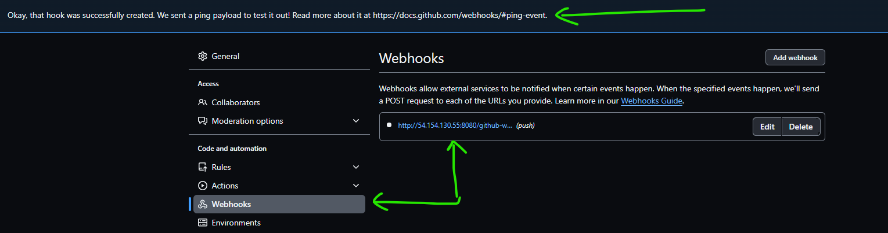
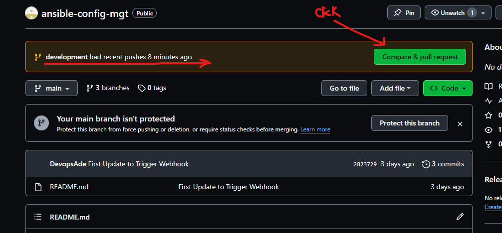
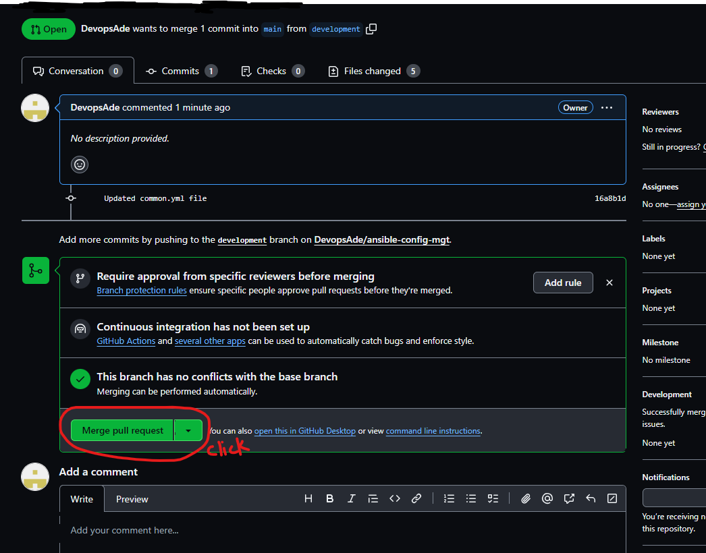

# Ansible Configuration Management 

- In this project we are going to experience the power of automation with Ansible by simplifying complex tasks and streamlining 

an IT infrastructure.

- What is Ansible?

Ansible is an open-source software platform utilized for automating configuration management. It is renowned for its scalability, flexibility, and

ease of use, and is widely used in various industries such as finance, healthcare, and technology. 

In 2015, it was acquired by Red Hat, Inc. and has since become one of the leading automation tools in the market.

It uses YAML, a simple and powerful language for describing automation tasks declaratively, which makes it easy to understand and maintain.

- In the following link Below, Click and read about Ansible, **`it's uses`**, **`How Ansible Works`**, **`Ansible Playbook Example`**

[What is Ansible in DevOps and How it Works](https://kodekloud.com/blog/ansible-in-devops/)

# Ansible Client as a Jump Server (Bastion Host)

- A Jump Server (sometimes also referred as Bastion Host) is an intermediary server through which access to internal network can be provided. 

If you think about the current architecture you are working on, ideally, the webservers would be inside a secured network which cannot be reached 

directly from the Internet. That means, even DevOps engineers cannot SSH into the Web servers directly and can only access it through a Jump Server.

It provide better security and reduces attack surface. On the diagram below the Virtual Private Network (VPC) is divided into two subnets.

Public subnet has public IP addresses and Private subnet is only reachable by private IP addresses.


## TASKS:

- Install and configure Ansible Client to act as a Jump Server/Bastion Host

- Create a simple Ansible playbook to automate servers configuration

# Install and Configure Ansible on EC2 Instance

# Step 1: Install and Configure Ansible on EC2 Instance

1. Update the **`Name`** tag on your **`Jenkins`** EC2 instance to **`Jenkins_Ansible`**. We will use this server to run playbooks.


- Run **`sudo apt update -y`** to update packages and releases.

- Install Ansible using the command **`sudo apt install ansible`**

- Go to **`Jenkins.io`** and select **`Ubuntu OS`** to install open JDK requirements to install Jenkins [Jenkins Package](https://pkg.jenkins.io/debian/)

- Use this code below:


- Now install the latest Jenkins [Install Jenkins](https://www.jenkins.io/doc/book/installing/linux/)

```sudo wget -O /usr/share/keyrings/jenkins-keyring.asc \
  https://pkg.jenkins.io/debian-stable/jenkins.io-2023.key
echo deb [signed-by=/usr/share/keyrings/jenkins-keyring.asc] \
  https://pkg.jenkins.io/debian-stable binary/ | sudo tee \
  /etc/apt/sources.list.d/jenkins.list > /dev/null
sudo apt-get update
sudo apt-get install jenkins
```
- Let's check the ansible version we running use this command **`ansible --version`**


- And also check the status of the Jenkins **`sudo systemctl status jenkins`** && NOTE: to restart use **sudo systemctl restart jenkins.service`**


- Note, for us to use Jenkins we have to edit inbound rules on the security group. **`Jenkins uses PORT 8080`**


- Now click on the public IP Address and type it like this followed by the port number **`http://54.154.130.55:8080/`**


- Now to unlock Jenkins below after pasting the **`url`** followed by port **`8080`**. Use **`sudo cat /var/lib/jenkins/secrets/initialAdminPassword`**


- Copy the HASH PASSWORD to unlock Jenkins.


- Click to install Suggested Plugins


2. In your GitHub account create a new repository and name it **`ansible-config-mgt`**


- Now let's initialize a git repo where we have **`ansible-config-mgt`**, remember to open it with **`VSCODE`** and run the following command below:

```$ echo "# ansible-config-mgt" >> README.md
git init
git add README.md
git commit -m "first commit"
git branch -M main
git remote add origin https://github.com/DevopsAde/ansible-config-mgt.git
git push -u origin main
```


- Create a new Freestyle project **`ansible`** in Jenkins and point it to your 'ansible-config-mgt' repository.

1. **`Skip and continue as admin`** && **`Save and Continue`**


- Configure a webhook in GitHub and set the webhook to trigger **`ansible`** build.


- Now we want jenkins to communicate with GitHub we paste **`http://54.154.130.55:8080/`** of jenkins in the field followed by **`github-webhook/`**

- And change the **`Content type`** to **`application/json`**




- Configure a Post-build job to save all (**) files.

1. Specify the source code management. Copy the webhook url **`https://github.com/DevopsAde/ansible-config-mgt`**


- On the Post-Build option select **`Artifacts`**


- And type **`**`** wildcard to save all files && Click **`Apply`** && **`Save`**.


2. Test the setup by making some changes to the **`README.md`** file in **`main`** branch and make sure that builds starts automatically and Jenkins

saves the files (build artifacts) in the following folder **`ls /var/lib/jenkins/jobs/ansible/builds/<build_number>/archive/`**


Now your setup will look like this in the image below:


# Step 2: Prepare your development environment using Visual Studio Code

1. First part of 'DevOps' is 'Dev', which means you will require to write some codes and you shall have proper tools that will make your coding

and debugging comfortable, you need an Integrated development environment (IDE) or source-code editor. There is a plethora of different IDEs and 

source-code Editors for different languages with their own advantages and drawbacks, you can choose whichever you are comfortable with, but we 

recommend one free and universal editor that will fully satisfy your needs - Visual Studio Code (VSC), and you can get it here [here](https://code.visualstudio.com/download)

2. After you have successfully installed VSC, configure it to connect to your newly created GitHub Repository.

3. Clone down your ansible-config-mgt repo to your Jenkins-Ansible instance

# Step 3: Begin Ansible Development

1. In your **`ansible-config-mgt`** GitHub repository, create a new branch that will be used for development of a new feature.

**Tip:** Give your branches descriptive and comprehensive names, for example, if you use **`Jira`** or **`Trello`** as a project management tool

include ticket number (e.g. **`PRJ-145`**) in the name of your branch and add a topic and a brief description what this branch is about - a **`bugfix`**

**`hotfix`**, **`feature`**, **`release`** (e.g. **`feature/prj-145-lvm`**)


2. Checkout the newly created feature branch to your local machine and start building your code and directory structure.


3. Create a directory and name it **`playbooks`** - it will be used to store all your playbook files.

4. Create a directory and name it **`inventory`** - it will be used to keep your hosts organised.

**`mkdir playbooks inventory`**


5. Within the playbooks folder, create your first playbook, and name it **`common.yml`**. **TIP:** Create a file under playbook

6. Within the inventory folder, create an inventory file () for each environment (Development, Staging Testing and Production) 

**`dev`**,**`Staging`**, **`uat`**, & **`prod`** respectively. These inventory files use **`ini`** languages style to configure Ansible hosts.


# Step 4: Setup an Ansible Inventory

An Ansible inventory file defines the hosts and groups of hosts upon which commands, modules, and tasks in a playbook operate. Since our 

intention is to execute Linux commands on remote hosts, and ensure that is the intended configuration on a particular server that occurs.

It is important to have a way to organize our hosts in such inventory.

Save the below inventory structure in the **`inventory/dev`** file to start configuring your *development* servers. Ensure to replace the IP

addresses according to your own setup.

**NOTE:** Ansible uses TCP port 22 by default, which means it needs to **`ssh`** into target servers from **`Jenkins-Ansible`** host- for this

you can implement the concept of **`ssh-agent`**. Now you need to import your key into **`ssh-agent`**:

To learn how to setup SSH agent and connect VS Code to your Jenkins_Ansible instance, please see the video below:

- For windows users - [ssh-agent on windows](https://www.youtube.com/watch?v=OplGrY74qog)

- For Linux users - [ssh-agent on linux](https://www.youtube.com/watch?v=OplGrY74qog)

- Confirm the key has been added with the command below, you should see the name of your key, use **`ssh-add -l`**


- Now lets try and ssh into another server instances. The image below:


# Step 5: Create a Common Playbook

It is time to start giving Ansible the instructions on what you need to be performed on all servers listed in **`inventory/dev`**/

In **`common.yml`** playbook you will write configuration for repeatable, re-usable, and multi-machine tasks that is common to systems

within the infrastructure. Update your **`playbooks/common.yml`** file with the following code.
```
---
- name: update web and nfs servers
  hosts: webservers, nfs, db
  remote_user: ec2-user
  become: yes
  become_user: root
  tasks:
    - name: ensure wireshark is at the latest version
      yum:
        name: wireshark
        state: latest

- name: update LB and DB server
  hosts: lb, db
  remote_user: ubuntu
  become: yes
  become_user: root
  tasks:
    - name: Update apt repo
      apt: 
        update_cache: yes

    - name: ensure wireshark is at the latest version
      apt:
        name: wireshark
        state: latest
```

Examine the code above and try to make sense out of it. This playbook is divided into two parts, each of them is intended to perform the same task: 

install wireshark utility (or make sure it is updated to the latest version) on your RHEL 8 and Ubuntu servers. 

It uses root user to perform this task and respective package manager: **`yum`** for RHEL 8 and **`apt`** for Ubuntu.

Feel free to update this playbook with following tasks:

- Create a directory and a file inside it

- Change timezone on all servers

- Run some shell script etc
  
For a better understanding of Ansible playbooks – watch this [video](https://youtu.be/ZAdJ7CdN7DY) from RedHat and read this

[article](https://www.redhat.com/en/topics/automation/what-is-an-ansible-playbook).   

## Step 6 – Update GIT with the latest code

Now all of your directories and files live on your machine and you need to push changes made locally to GitHub. It is important to learn how to collaborate with help of **`GIT`**. 

In many organisations there is a development rule that do not allow to deploy any code before it has been reviewed by an extra pair of eyes – it is also called "Four eyes principle".

Now you have a separate branch, you will need to know how to raise a Pull Request (PR), get your branch peer reviewed and merged to the **`master`** branch.

Commit your code into GitHub:

1. Use git commands to add, commit and push your branch to GitHub.

`git status`

`git add <selected files>`

`git commit -m "commit message"`


  


2. Create a Pull request (PR)




3. Wear the hat of another developer for a second, act as a reviewer.

4. If the reviewer is happy with your new feature development, merge the code to the **`master`** branch.




5. Head back on your terminal, checkout from the feature branch into the master, and pull down the latest changes.


Once your code changes appear in master branch – Jenkins will do its job and save all the files (build artifacts) to `/var/lib/jenkins/jobs/ansible/builds/<build_number>/archive/ directory on Jenkins-Ansible server.`


Let's also verify in the Terminal with the image below:


# Step 7 - Run First Ansible Test

# NOTE: RUN THIS COMMAND BELOW TO EXECUTE THE LATEST BUILD VIA JENKINS BUILD NUMBER:


Now, it is time to execute ansible-playbook command and verify if your playbook actually works:

1. Setup your VSCode to connect to your instance. Now let's run the playbook using the command below:

- Now lets clone this repo **`https://github.com/DevopsAde/ansible-config-mgt`** to the **`Bastion Server`** 


- Now change directory into **`cd ansible-config-mgt`**


- Now let's go and check each of the servers to see if **`wireshark`** has been installed by running **`which wireshark`** or **`wireshark --version`**


- Your updated Ansible Architecture now looks like this:


# Congratulations!! You have just automated your routine tasks by implementing your first Ansible project!