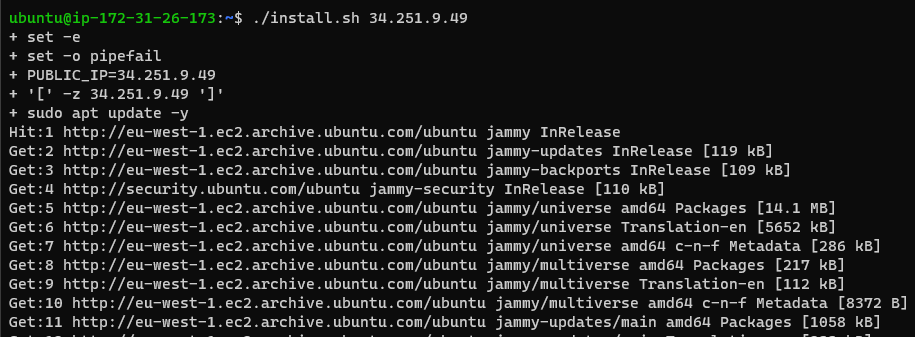

# Automating LoadBalancer configuration with Shell Scripting

- This project demonstrates load balancer configuration using shell scripting and CI/CD on Jenkins, and also using 

automation process to setup and maintain load balancer.

## Automate the Deployment of Webservers

- In the previous project **`IMPLEMENTING LOADBALANCERS WITH NGINX`**, remember we deployed two backend servers, with 

a load balancer distributing traffic across the webservers. Note, we did all configurations and commands via the terminal.

Now, imagine automating the whole process. We will achieve this by writing a shell script, that when executed

all we did manually will be done automatically.

# Deploying and Configuring the Webservers

# STEPS:

- Provision two EC2 instance running Ubuntu 22.04 **`Server_A`** && **`Server_B`**

- Open Port 8000 to allow traffic from anywhere using the Security Group on both Servers

- Connect to the Webserver via the terminal using SSH Client

- Open a file and paste the script below using **`sudo vi install.sh`**

- **`ctrl + X && Y and Hit Enter`** to close and save the file.

- Change the permissions on the file to make it executable using the command: **`sudo chmod +x install.sh`** 

- Run the shell script using the command below. 

**`./install.sh 34.251.9.49`**. 

- Output Below:

