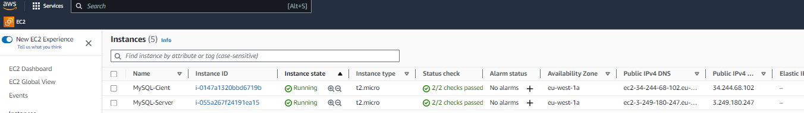

# Understanding Client Server Architecture with MySQL as RDBMS

- In this topic we going to gain a comprehensive understanding of data management, connectivity, and communication

between clients and servers.

First let's define what actually a Client and Server is?

- Client: A client is a user or system that requests a specific resource or service from another entity know as server

**WHILE**

- SERVER: Is a resource or service provider that listens for incoming requests from clients and responds to those requests.                                        

## Client-Server Architecture with MySQL

*What is Client-Server Architecture* : Client-Server refers to an architecture in which two or more computers

are connected together over a network to send and receive requests between one another.

- Example: **`MACHINE A`** sending requests is called CLIENT & **`MACHINE B`** responding (serving the request) is called SERVER. 

Below is an explanatory diagram of a Client and Server Requests and Responses and examples of client-server applications.

**`source: zenarmor.com/docs/network-basics/what-is-client-server-network`**

NOTE: The client system trys to access the Website using the Web browser and sends HTTP requests to a Web server 

(Apache, Nginx, IIS or any other) over the internet.

Now, if we dive further by adding a Database Server we get a sample architecture below:

Lets analyse what's happening in the diagram above. In this case, the Web Server acts has a "Client" which connects and

reads/writes to/from a Database (DB) server (MySQL, MongoDB, Oracle, SQL Server or any other), note, the communication between them 

happens over a Local Network or Internet Connection (it's a common practice to place the Web Server and DB Server close to each other 

in the local network).

- Example of a Client-Server Communication in action, here we would open our Ubuntu System or Windows Terminal 

and run the **`curl`** command.

**NOTE**: The Ubuntu does not have the **`curl`**, so we install it running **`sudo apt install curl`**

In this example, the Ubuntu terminal is the **client**, while **`www.propitixhomes.com`** will be the **server**.

Now, that we have the **`curl`** command installed, lets re-run the **`curl -Iv www.propitixhomes.com`**. 

## NOTE

- The **`I`** or **`location`**: This option tells **`curl`** to follow HTTPS redirects. When a server responds with a redirect

(HTTP status codes 3xx), **`curl`** will automatically make additional requests to the new location specified in the

redirect header.

- **`v`** or **`verbose`**: This option makes **`curl`** more chatty. It displays detailed information about the request

and response, including headers and other relevant details. It's useful for debugging and understanding the

communication between the client and the server.

So, when you use **`curl -Iv`**, you are asking **`curl`** to not only follow redirects but also provide detailed

verbose output for each step of the communication. This can be particularly helpful when troubleshooting  network

or HTTP-related issues.

- Output below: This shows the requests from the URL are being collected from a computer with an IP address

of **`75.2.115.196`** on port **`80`**.

Alternatively, another way to get a server's IP address is to use a diagnostic tool called **`PING`**. This will show 

round-trip time, time for packets to go to and back from the server. Note, this tool uses **`ICMP PROTOCOL`**.

## IMPLEMENT A CLIENT SERVER ARCHITECTURE USING MySQL DATABASE MANAGEMENT SYSTEM (DBMS)

In this section, we going to implement a Client Sever Architecture using MySQL Database Management System (DBMS).

We going to demonstrate a basic client-server using MySQL RDBMS, by Creating and Configuring two Linux-based virtual 

servers (EC2 instances in AWS). **`Server A name - MySQL-server`** and **`Server B name - MySQL-client`**

 But first we going to use **`MySQL server`** local IP address to connect from **`MySQL client`**. MySQL server uses 
 
 TCP port **`3306`** by default, so we going to create a new entry in 'INBOUND RULES' in 'mysql server' Security Groups.

- Output below:

On **`MySQL server`** Linux Server install MySQL Server Software. 

**`sudo apt update`**

Next, is to install the MySQL-Server Package

**`sudo apt install mysql-server`**

To ensure the server is running use the command **`systemctl`** command:

**`sudo systemctl start mysql.service`** and Hit Enter, then Type **`sudo systemctl status mysql.service`** 

Note: **`ALTER USER 'root'@'localhost' IDENTIFIED WITH mysql_native_password BY 'Password.1';`** was used.

**`Run MySQL secure Installation`** using the **`sudo mysql_secure_installation`**

- Now we going to create a database named Testing_db and user named admin_user.

- Then we connect to the MySQL console using the **`sudo mysql -p`** command.

- Lastly, is giving the user permission over the Testing_db database.

- Below are the commands used in creating a Database and a new user to grant full access to the database.

*Note:* This will basically give the admin_user full priviledge over the Testing_database, while preventing this user from 

creating or modifying other database on the server.

Exit the shell by hitting by typing **`Exit`**

- Now lets confirm if the new user has the proper permissions by logging into MySQL console again, using the 

**`mysql -u admin_user -p`**

*NOTE:* The **`-p`** flag is use to prompt for the password used when creating the **`admin_user`**.

- Now, lets confirm if we have access to Testing_databse my using the command **`SHOW DATABASE;`**

- Exit MySQL console and restart the MySQL service using this 2 following commands below:

- **`sudo systemctl restart mysql`** *and* **`sudo systemctl status mysql.service`** 

**Next, is to configure MySQL Server to allow connections from remote hosts**. Now lets run this command below

**`sudo nano /etc/mysql/mysql.conf.d/mysqld.cnf`**. Edit the **`bind-address`** and replace **`127.0.0.1`** to **`0.0.0.0`**

## SETTING UP MYSQL CLIENT

- SSH into MySQL client EC2 instance

- Run the following command to install MySQL client software. **`sudo apt update && sudo apt upgrade`**

- Install the mysql-client package using the **`sudo apt install mysql-client -y`** command.

- Now from the MySQL client instance we going to connect remotely to MySQL server databse using the command below:

**`sudo mysql -u admin_user -h 172.31.28.61 -p`**

- Finally, type the command in MySQL console : **`SHOW DATABASE`**

## THANK YOU

