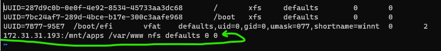
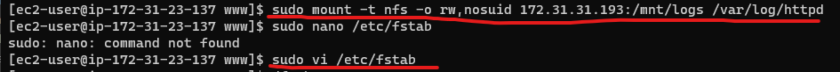
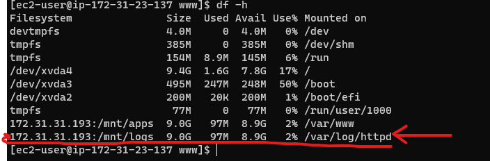

# Devops Tooling Website Solution

In this project we going to explore the integration of various tools and technologies to create a unified platform

that enhances collaboration, automation, and efficiency for software development and operations teams.

- NOTE: In the just concluded project **`IMPLEMENTING WORDPRESS WEBSITE WITH LVM STORAGE MANAGEMENT`**, we implemented

a WordPress based solution filled with content, which can be used as a full fledged website or blog.

Now, to expantiate further we will add some more value to the solutions that the DevOps team can utilize. This includes

introducing a set of DevOps tools that will help our team in day to day activities in managing, developing, testing,

deploying and monitoring different projects.

## TOOLS

The tools we want our team to use are widely used by multiple DevOps teams.

- Jenkins - Free and open source automation server used to build **`CI/CD`** pipelines.

- Kubernetes - An open-source container-orchestration system for automating computer application deployment, scaling and management.

- Jfrog Artifactory - Universal Repository Manager supporting all major packaging formats, build tools and CI servers.

- Rancher - An open source software platform that enables organizations to run and manage Docker and Kubernetes in production.

- Grafana - A multi-platform open source analytics and interactive visualization web application.

- Prometheus - An open-source monitoring system with a dimensional data model, flexible query language, efficient time series

database and modern alerting approach.

- Kibana - Kibana is a free and open user interface that lets you visualize your Elasticsearch data and navigate the Elastic Stack.

## In this project we going to implement a solution that consists of the following components:

1. Infrastructure: AWS

2. Webserver Linux: RedHat Enterprise Linux 8

3. Database Server: Ubuntu 20.04 + MySQL

4. Storage Server: RedHAt Enterprise Linux 8 + NFS Server

5. Programming Language: PHP

6. Code Repository: GitHub

The diagram below comprises of several stateless Web Servers that share a common database and also access the same files using

Network File System (NFS) as a shared file storage. Despite the NFS server been located on a completely separate hardware, for Web Servers

it looks like a local file system from where they can serve the same files.


It is important to know what storage solution is suitable for what use cases. Questions like: what data will be stored, in what format

how this data will be accessed, by whom, from where, how often, etc. Base on this we will be able to choose the right storage system

for our solution.

## IMPLEMENTING A BUSINESS WEBSITE USING NFS FOR THE BACKEND FILE STORAGE

# STEP 1: PREPARE NFS SERVER

1. Spin up a new EC2 instance with RHEL Linux 8 operating system.

2. Based on the LVM experience from the [3-tier architecture project](https://github.com/DevopsAde/Devops_Project/blob/main/

IMPLEMENTING%20WORDPRESS%20WEBSITE%20WITH%20LVM%20STORAGE%20MANAGEMENT/README.md), configure LVM on the Server.

3. Instead of foramting the disks as **`ext4`** format them as **`xfs`**


4. Ensure there are 3 Logical Volumes: **`lv-opt`**, **`lv-apps`**, and **`lv-logs`**


5. Create mount points on **`/mnt`** directory for the logical volumes as follow:

- Mount **`lv-apps`** on **`/mnt/apps`** to be used by webservers.

- Mount **`lv-logs`** on **`/mnt/logs`** to be used by webservers logs.

- Mount **`lv-opt`** on **`/mnt/opt`** to be used by Jenkins server.


6. Install NFS server, configure it to start on reboot and its up and running. Use the command below:


7. Export the mounts for webservers subnet CIDR to connect as clients. For simplicity, we going to install all 3 webservers inside the 

same subnet, but in the production set up you would probably want to separate each tier inside its own subnet for higher level of security.

To check the **`subnet cidr`**- let's open our EC2 details on the AWS web console and locate the **Networking** tab and open a Subnet link:


- Make sure we set up permission that will allow our Web servers to read, write and execute files on NFS:


- Next we configure access to NFS for clients within the same subnet (example of Subnet CIDR -**`172.31.16.0/20`**)

- Do **`sudo vi /etc/exports`** and paste this inside and Press **`Esc + :wq!`**


- Edit and check the **`<Subnet-CIDR>`**.


- Now replace the **`Subnet-CIDR`** with the ip address **`172.31.16.0/20`** still in the **`VI MODE`** & check by 

running **`cat`** to verify it's all saved.


- Execute **`sudo vi /etc/exports`**


8. Now, check which port is been used by NFS and open it using Security Groups (Hint: Add inbound Rule). Use the command below

**`rpcinfo -p | grep nfs`**


*IMPORTANT NOTE: IN ORDER FOR NFS SERVER TO BE ACCESSIBLE FROM MY CLIENT, WE MUST OPEN THE FOLLOWING PORTS:* 

**`TCP 111, UDP 111, UDP 2049`**


# STEP 2: CONFIGURE BACKEND DATABASE AS PART OF 3 TIER ARCHITECTURE

1. Install MySQL Server


*Now that we have MySql active and running*

2. Now we Create a Database and name it **`tooling`** & Remember to use **`sudo mysql`**.

3. Create a Database user and name it **`webaccess`**

4. Grant permission to **`webaccess`** user on **`tooling`** database to do anything only from the webservers **`subnet cidr`**


# STEP 3: PREPARE THE WEB SERVERS

- We need to make sure that our WebServers can serve the same content from shared storage solutions, in this case

NFS Server and MySQL Database. We already know that one DB can be accessed for **`reads`** and **`writes`** by multiple clients.

For storing shared files that our Web Servers will use, we will utilize NFS and mount previously created Logical Volume **`lv-apps`**

to the folder where Apache stores fils to be served to the users **`/var/www`**.

This approach will make our Web Servers **`stateless`**, which means we will be able to add new ones or remove them whenever we 

need and the integrity of the data (in the database and on NFS) will be preserved.

During the next steps we will do the following:

- Configure NFS Client (this step must be done on all 3 servers)

- Deploy a Tooling application to our Web Servers into a shared NFS folder

- Configure the Web Servers to work with a single MySQL database.

1. Launch a New EC2 instance with **`RHEL 8 Operating System`** and name it **`WEB_SERVER`**

2. Install NFS Client with the following command **`sudo yum install nfs-utils nfs4-acl-tools -y`**


3. Mount **`/var/www/`** and target the NFS server export for apps. Use this command below to execute.

**`sudo mkdir /var/www`** && **`sudo mount -t nfs -o rw,nosuid <NFS-Server-Private-IP-Address>:/mnt/apps /var/www`**

4. Verify that NFS was mounted successfully by running **`df -h`**.


And make sure that the changes will persist on 

Web Server after reboot: Execute the **`sudo vi /etc/fstab`** and add the following line below:



**`<NFS-Server-Private-IP-Address>:/mnt/apps /var/www nfs defaults 0 0`** in this case i will change the NFS private IP to

this **`172.31.31.193:/mnt/apps /var/www nfs defaults 0 0`**.

5. Now Install Remi Repository, Apache and PHP with the following command below:

```sudo dnf install https://dl.fedoraproject.org/pub/epel/epel-release-latest-8.noarch.rpm -y

sudo dnf install dnf-utils http://rpms.remirepo.net/enterprise/remi-release-8.rpm -y 

sudo dnf module reset php

sudo dnf module enable php:remi-7.4 -y

sudo dnf install php php-opcache php-gd php-curl php-mysqlnd -y
	
sudo systemctl start php-fpm

sudo systemctl enable php-fpm

sudo setsebool -P httpd_execmem 1
```

# REPEAT STEPS 1-5 FOR THE NFS SERVER & DATABASE SERVER

6. Verify that Apache files and directories are avaiable on the Web Server in **`/var/www`**.


And also on the NFS server:


- In **`/mnt/apps`**. If you see the same files, it means NFS is mounted correctly. Fronm the screenshot above its the same files.

- You can try to create new file **`touch test.txt`** from one server and check if the same file is accessible from other Web Servers.

- Use the command **`sudo touch test.txt`**. Screenshot below proves the file **`test.txt`** is accessible from both Web Servers.

*NFS_SERVER*


*WEB_SERVER*


7. Locate the log folder for Apache on the Web server and mount it to NFS server's export for logs. Repeat step №4 to make sure

the mount point will persist after reboot.




*df -h to verify NFS Mounted Successfully*



8. Fork the tooling website's code from [this repo](https://github.com/IwunzeGE/DevopsToolingWebsite) to your Github account. 

(Learn how to fork a repo [here](https://youtu.be/f5grYMXbAV0))

9. Deploy the tooling website’s code to the Webserver. Ensure that the html folder from the repository is deployed to **`/var/www/html`**

