# Implementing Wordpress Website with Logical Volume Management

## Understanding 3 Tier Architecture

- What is WordPress:

WordPress is a free and open-source content management system written in PHP and paired with **`MySQL`** or **`MariaDB`**

as its backend Relational Database Management System (RDBMS)

- Web Solution With WordPress

In this project we will provision storage infrastructure on two Linux Servers and Implement a Basic Web Solution using

**`WordPress`**. To elaborate further, this Project comprises of two parts:

- Configure Storage Subsystem for Web and Database Servers based on Linux OS (Working with disks, partitions and volumes in Linux)

- Install WordPress and connect it to a remote MySQL database server. (Deploying Web and DB tiers of Web solution)

- Three-tier Architecture

*Three-tier Architecture* is a client-server software architecture, which is generally a web, or mobile solutions. It comprises 

of 3 seperate layers.

*Three-tier Architecture*

1. **`Presentation Layer (PL)`**: This is the user interface such as the client server or browser on your laptop.

2. **`Business Layer (BL)`**: This is the backend program that implements business logic. Application or Webserver.

3. **`Data Access or Management Layer (DAL)`**: This is the layer for computer data storage and data access. **`Database Server`**

or File System Server such as **`FTP Server`** or **`NFS Server`**

- In this project, we will showcase **Three-tier Architecture** ensuring that the disks used to store files on the Linux servers

are adequately partitioned and managed through programs such as **`gdisk`** and **`LVM`** respectively.

- **In this 3-Tier Setup, prerequiste required below**:

1. A Laptop or PC to serve as a client

2. An EC2 Linux Server as a Web Server (This is where we will install WordPress)

3. An EC2 Linux Server as a Database (DB) server

# NOTE:

- We going to use **`RedHat`** OS for this project, remember for Ubuntu server we connect via SSH/Putty or any other tool

we use **`Ubuntu`** user, but for RedHat we will need to use **`ec2-user`** user. Connection string will look like this

**`ec2-user@<Public-IP>`**

## Implementing LVM on Linux Servers(Web and Databse Servers)

- Step 1: Prepare a Web Server

1. Launch an EC2 instance that will serve as WebServer. Create 3 volumes in the same Availability Zone as the WebServer 

EC2, each of 10 GiB

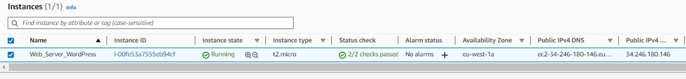
*Web_server_WordPress*

*Three of 10 GiB Volumes each created, availability zone eu-west-1a same with the EC2 instance*

2. Attach all three volumes one by one to the Web_server_WordPress EC2 Instance Created.

*Volumes Attached*

# NOTE: All volumes attached and ready in-use in the screenshot below:

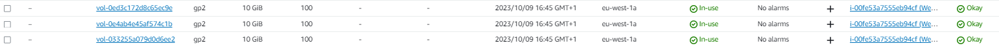

3. Open up the Linux Terminal to Begin Configuration and use **`lsblk`** command to inspect what block devices

are attached to the server.

*Newly Created Devices*

- Note, all devices in Linux reside in **`dev/directory`**. Inspect it with the command **`ls /dev/`**. The 3 newly

created block devices will be **`xvdf`**, **`xvdh`**, **`xvdg`**.

4. Use **`df -h`** command to see all mounts and free space on the server.

5. Use **`gdisk`** utility to create a single partition on each of the 3 disks. Use this 

command **`sudo gdisk /dev/xvdf`**, **`/xvdg`**, **`/xvdh`**. Successful Screenshot below:

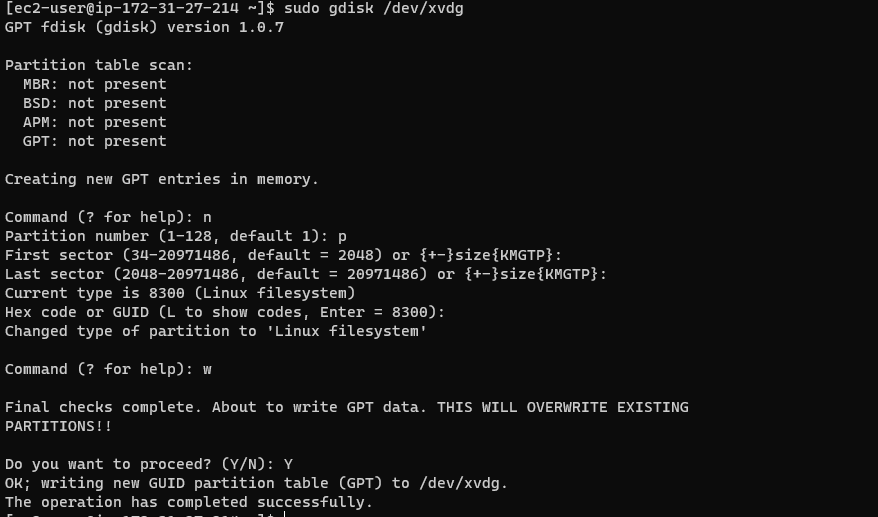

*xvdg Partitioning*

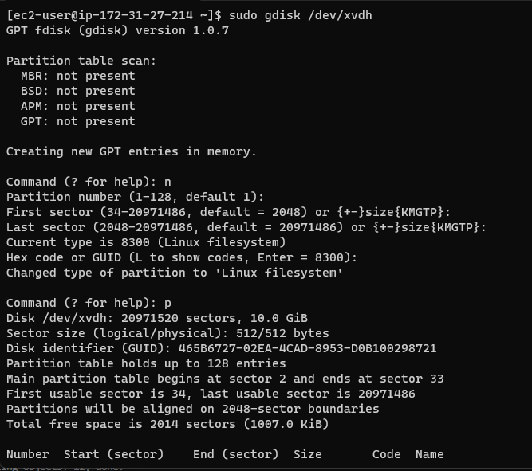

*xvdh Partitioning*

6. Now use **`lsblk`** utility to view the newly configured partition on each of the disks.

- Check out the output below for newly created partitions on each devices.

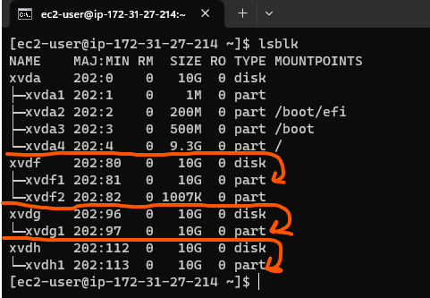

*Partitions Created*

7. Install **`Ivm2`** package using **`sudo yum install Ivm2`**.

- HIT **`y`** and **`ENTER`** to Install. Then, run **`sudo lvmdiskscan`** command to check for available partitions.

- NOTE: We using **`yum`** to install packages because we using the RedHat/CentOS not Ubuntu which is **`apt`**.

8. Now, use **`pvcreate`** utility to mark each of the 3 disks as physical volumes to be used by LVM.

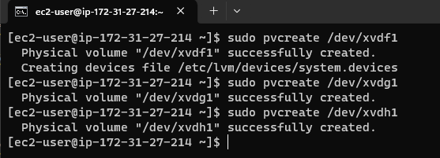

9. Lets now verify if the physical volume has been created successfully by using the command **`sudo pvs`**

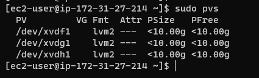

10. Use **`vgcreate`** utility to add all 3 **`pvs`** to a volume group (VG). Let's name it *webdata-vg*

using this command as follows: **`sudo vgcreate webdata-vg /dev/xvdh1 /dev/xvdg1 /dev/xvdf1`**

11. Let's verify the VG was created successfully running **`sudo vgs`**

12. Let's now create 2 logical volumes. apps-lv(will be used to store data for the website) and logs-lv(used to

store data for logs). We use the following commands below:
- **`sudo lvcreate -n apps-lv -L 14G webdata-vg`**

- **`sudo lvcreate -n logs-lv -L 14G webdata-vg`**

13. Verify the logical volume has been created successfully by running the command **`sudo lvs`**

14. Let's verify the entire setup, using the command below:

- **`sudo vgdisplay -v`** (used to view complete setup - **`VG, PV, and LV`**)

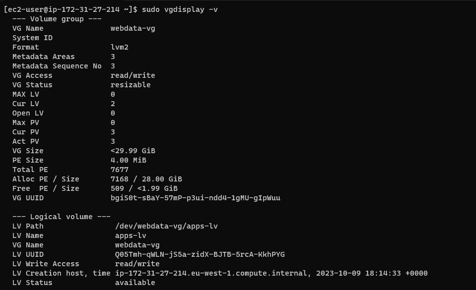

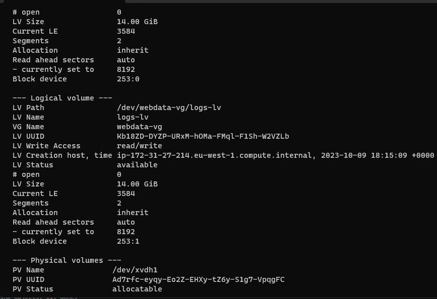

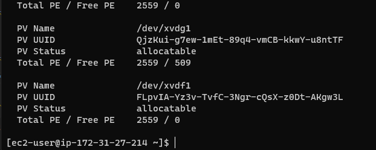

15. Let's use **`mkfs.ext4`** to format the logical volumes with *ext4* filesystem. Use the command below:

- **`sudo mkfs -t ext4 /dev/webdata-vg/apps-lv`** && **`sudo mkfs -t ext4 /dev/webdata-vg/logs-lv`**

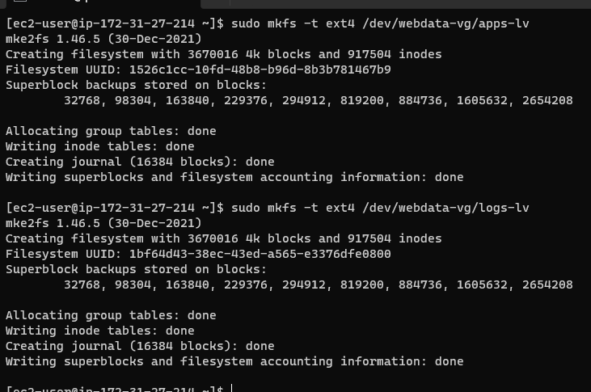

16. Now, create **/var/www/html** directory to store website files. Use the command below:

**`sudo mkdir -p /var/www/html`**

17. Create **/home/recovery/logs** to store backup of log data. Use the command below:

**`sudo mkdir -p /home/recovery/logs`**

18. Mount **/var/www/html** on **apps-lv** logical volume. Using the command below:

**`sudo mount /dev/webdata-vg/apps-lv /var/www/html/`**

19. Use the **`rsync`** utility command to backup all the files in the log directory **/var/log** 

into **/home/recovery/logs**. (Required before mounting the file system)

20. Mount **/var/log** on **logs-lv** logical volume. (Note that all the existing data data on /var/log will be deleted

That's why step 16 above is crucial). Run the command: **`sudo mount /dev/webdata-vg/logs-lv /var/log`**

21. Now restore log files back into **/var/log** directory. Use the command below:

**`sudo rsync -av /home/recovery/logs/. /var/log`**

22. Update **`/etc/fstab`** file so that the mount configuration will persist after restart of the server.

- Check the UUID of the device using **`sudo blkid`**

23. Run the **`sudo vi /etc/fstab`** to update own UUID from the image above.

24. Lastly let's test the configuration and reload the daemon using the command below:

- **`sudo mount -a`** && **`sudo systemctl daemon-reload`** and verify the setup running **`df -h`**

# Installing WordPress and Configuring to use MySQL Database

- Step 2: Prepare the Database server

Now we going to launch a second RedHat EC2 instance that will have a role- **`DB Server`**.

Take Note: Repeat the same steps as for the Web Server, but instead of **`apps-lv`** create **`db-lv`** and mount it

to **`/db`** directory instead of **`/var/www/html`**

- Step 3: Install WordPress on the WEb SErver EC2

1. Update the repository **`sudo yum -y update`**

2. Install wget, Apache and it's dependencies **`sudo yum -y install wget httpd php php-mysqlnd php-fpm php-json`**

3. Start Apache with the command below:

- **`sudo systemctl enable httpd`** && **`sudo systemctl start httpd`**

4. To install PHP and it's dependencies run this following command below:

5. Restart Apache: **`sudo systemctl restart httpd`**

6. Download WordPress and copy WordPress to **`var/www/html`**

7. Configure SELinux Policies

- Step 4: Install MySQL on the DB_Server EC2 Instance, using the command below:

- Verify that the service is up and running by using **`sudo systemctl status mysqld`**

- If its running restart the service and enable it using the command below:

- **`sudo systemctl restart mysqld`** && **`sudo systemctl enable mysqld`**

- Step 5: Configure DB to work with WordPress using the command below:

- # SHOW DATABASE

- Step 6: Configure WordPress to connect to remote database:

- NOTE: Remember to open MySQL port 3306 on **`DB_SERVER`** EC2 instance. For extra security allow access to the DB 

server **ONLY** from the Web Sever IP address, then specify in the inbound rule configuration source /32. 

