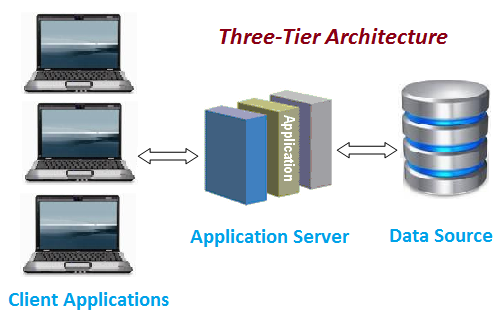

# Implementing Wordpress Website with Logical Volume Management

## Understanding 3 Tier Architecture

- What is WordPress:

WordPress is a free and open-source content management system written in PHP and paired with **`MySQL`** or **`MariaDB`**

as its backend Relational Database Management System (RDBMS)

- Web Solution With WordPress

In this project we will provision storage infrastructure on two Linux Servers and Implement a Basic Web Solution using

**`WordPress`**. To elaborate further, this Project comprises of two parts:

- Configure Storage Subsystem for Web and Database Servers based on Linux OS (Working with disks, partitions and volumes in Linux)

- Install WordPress and connect it to a remote MySQL database server. (Deploying Web and DB tiers of Web solution)

- Three-tier Architecture

*Three-tier Architecture* is a client-server software architecture, which is generally a web, or mobile solutions. It comprises 

of 3 seperate layers.

*Three-tier Architecture*

1. **`Presentation Layer (PL)`**: This is the user interface such as the client server or browser on your laptop.

2. **`Business Layer (BL)`**: This is the backend program that implements business logic. Application or Webserver.

3. **`Data Access or Management Layer (DAL)`**: This is the layer for computer data storage and data access. **`Database Server`**

or File System Server such as **`FTP Server`** or **`NFS Server`**

