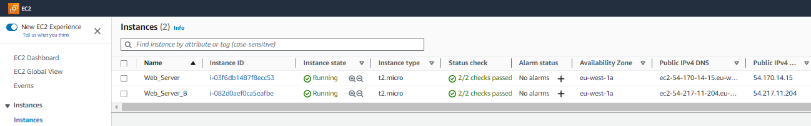
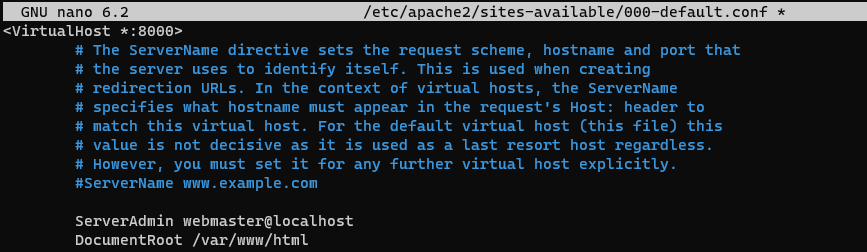

# Implementing Load Balancers with Nginx

- In this project, we going to learn how to distribute traffic efficiently across multiple servers, optimize

performance, and ensure high availability for your web applications.

## Introduction to Load Balancing and Nginx

- **`What is Load Balancing`**?

In simple terms, load balancing means distributing the work or tasks among several computers or servers so

that no computer gets overloaded with too much work. This helps to keep everything running smoothly and ensures

that websites and apps work quickly and don't get too slow.

Modern high-traffic websites must serve hundreds of thousands, if not millions, of concurrent  requests from

users or clients and return the correct text, images, video, or application data, all in a fast and reliable

manner. To cost-effectively scale to meet these high volumes, modern computing best practice generally requires adding

more servers.

A **`Load balancer`** acts as the "traffic cop" sitting in front of your servers and routing client requests across

all servers capable of fulfilling those requests in a manner that maximizes speed and capacity utilization and ensures

that no one server is overworked, which could degrade performance. If a single server goes down, the load balancer

redirects traffic to the remaining online servers. When a new server is added to the server group, the load balancer

automatically starts to send request to it.

*A typical Load Balancing Diagram*

# In this steps, a load balancer performs the following functions

- Distributes client requests or network load efficiently across multiple servers.

- Ensures high availability and reliability by sending requests only yo servers that are online.

- Provides the flexibility to add or subtract servers as demand dictates.

# Benefits of Load Balancing

- Reduced downtime

- Scalable

- Redundancy

- Flexibility

- Efficiency

# How NGINX can Help?

- Nginx is a versatile software, it can act like a **`webserver, reverse proxy, and a load balancer`**.

**`NGINX`** is the best-in-class load-balancing solutions used by high-traffic websites such as Dropbox, Netflix, and

Zynga. More than 350 million websites worldwide rely on NGINX to deliver their content quickly, reliably, and securely.

The comprehensive load balancing capabilities in NGINX enables you to build a high optimized application delivery network.

When you insert NGINXas a load balancer in front of your application and server, it increases your website's efficiency,

performance, and reliability. NGINX helps in maximizing customer satisfaction and return on IT investments.

# Setting Up a Basic Load Balancer

- In this exercise, we are going to provision two EC2 instances running ubuntu 22.04 and install Apache Webserver in them.

We will open the port 8000 to allow traffic from anywhere, and finally update the default page of the webservers to display 

their public IP address.

- Next we will provision another EC2 instance running Ubuntu 22.04, this time we will install Nginx and configure it to act as 

a load balancer distributing traffic acroos the webservers.

- Step 1: Create two Instances: In this  **`Web_Server && Web_Server_B`**

- Step 2: Edit inbound rules and open port 8000 on both "EC2 instances" created, and allow traffic from anywhere.

- Step 3: Install Apache Webserver

After provisioning both of our servers and have opened the necessary ports, we then install apache softare on both servers (EC2 Instances).

To do this we must connect to each of the webservers via **`ssh`**.

- Step 4: SSH into each webservers and run the following commands to install apache webservers on both EC2 instances 

(webservers) created.

- Step 5: Run this command **`sudo apt update -y && sudo apt install apache2 -y`** and verify that apache is running

using the command **`sudo systemctl status apache2`**, output below confirms apache is active and running successfully.

- Image 1: *Web_Server*

- Image 2: *Web_Server_B*

- Step 6: We will start by configuring **`Apache`** Webserver to serve content on port 8000 instead of its default port

which is port 80. Then next, will be to create a new **`index.html`** file. This file will contain code to display the 

public IP of the EC2 instance. We will then override the apache webserver's default HTML file with a new file.

- Using any text editor open the file **`/etc/apache2/ports.conf`**, use the **`sudo nano /etc/apache2/ports.conf`**

- Step 7: Add a new listen Directive for port 8000, **`Hit Ctrl + X, Hit Y and Enter`**. This saves the file.

- Step 8: Next open the file **`/etc/apache2/sites-available/000-default.conf`** and change **`port 80`** on the 

virtual host to **`8000`**.

- Step 9: Restart Apache to load the new configuration using the command below:

**`sudo systemctl restart apache2`**

# NOTE: Commands Preview used

- Next is to open a new **`index.html`** file using this command **`sudo nano index.html`**, but before pasting the **`HTML CODE`**

we need to get the public IP address of the EC2 instance and replace the placeholder text for IP address in the HTML file.

- Now, we will change the file ownership of the **`index.html`** file with the command below:

**`sudo chown www-data:www-data ./index.html`**

- Lets Overide the Default HTML file of the Apache Webserver:

1. Replace the default HTML file with our new HTML file using the command below:

**`sudo cp -f ./index.html /var/www/html/index.html`**

2. Now, lets Restart the webserver to load the new configuration using the command below:

**`sudo systemctl restart apache2`**

3. Let's now load the page on the browser to view it's content. Typed like this on the browser, remember with the 

Public IP Address:**`LISTEN PORT 8000`**

**`http://54.170.14.15:8000/`**. Output Below:

# NOTE: Commands Preview used 

*Web_Server EC2 Instance*

## NOTE: Repeat this above process for the second EC2 instance (Web_server_B), pay attention to the different IP Public Address.

# Configuring Nginx as a Load Balancer

- We will create a new EC2 instance. Open **`port 80`** to accept traffic from anywhere.

- Next, we SSH into the EC2 instance.

- And then Install Nginx into the instance using the command below:

**`sudo apt update -y`** && **`sudo apt install nginx -y`**.

- Next, we verify that **`NGINX`** is installed with the command below:

**`sudo systemctl status nginx`**

*NGINX INSTALLED AND VERIFIED SUCCESSFULLY*

- Next, open Nginx configuration file with the command below:

**`sudo nano /etc/nginx/conf.d/loadbalancer.conf`**

- Paste this configuration file below, this file configures nginx to act like a load balancer. Also, note to edit the file

and provide necessary information like your server IP address of both servers (EC2 instances).

- Test configurations. Use the command below:

**`sudo nginx -t`**

*configuration OK*

- Next, we restart Nginx to load the new configuration with the command below:

**`sudo systemctl restart nginx`**

- Finally, paste the Public address of Nginx Load Balancer. We should see the same webpages served by the webservers.

