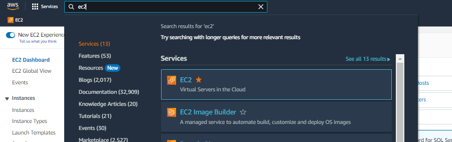
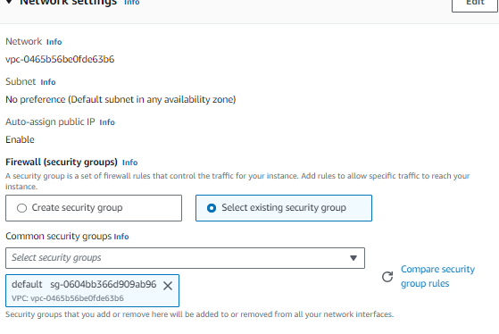

# Documentation For LAMP STACK IMPLEMENTATION

- This Project shows how to build and deploy web applications using the LAMP stack. It emphasis on creating dynamic websites by combining Linux, Apache, MySQL, and 

PHP.

## Types of Technology stack

- LAMP (Linux, Apache, MySQL, PHP or Python, or Perl)

- LEMP (Linux, Nginx, MySQL, PHP or Python, or Perl)

- MERN (MongoDB, ExpressJS, ReactJS, NodeJS)

- MEAN (MongoDB, ExpressJS, AngularJS, NodeJS)

Below we will create an EC2 instance, connect into it and establish a connection.

## STEPS IN CREATING AN EC2 INSTANCE

- Step 1:

Type ec2 on the search field

- Step 2

Click the launch instance highlighted in orange

- Step 3

Give your instance a name

- Step 4

Select the Ubuntu AMI Image and make sure is the free tier enabled so you dont incur costs

- Step 5

Create a key Pair, this will enabled you to securely SSH into the Ubuntu Machine. And the pem format should be selected.

- Step 6

Select the key pair you just created from the drop down menu.

- Step 7

For now select the default Security Group option

- Step 8

Hit the Launch button 

- Step 9

EC2 Instance launched successfully

- Step 10

Refresh the instance after initializing

- Step 11

Now on the far right corner click on connect to SSH into our Ubuntu Machine.

- Step 12

Select the SSH client option

- Step 13

Copy the ssh -i command full path address

- Step 14

But first remember when we created the key pair it was saved into downloads, to proceed we need to change directory to Downloads and paste the ssh - command full path

address into the terminal.

- Step 15

It will ask you to confirm Yes or Y, either will work by typing in the terminal Yes or Y.

- Step 16

Holla!!! You are now inside the Ubuntu AMI Machine.

## Installing Apache and Updating the Firewall

What is Apache

Apache is an open source software available for free. It runs on 67% of all webservers in the world. It is fast, reliable, and secure. Most WordPress hosting 

providers use Apache as their web server software.

Now, we going to install Apache using Ubuntu's package

manager **`apt`**:

so going back to the EC2 instance we created, remember we stopped it, now we going to start it to so has to enter into the ubuntu machine and install Apache. After 

successfully starting the EC2 instance, SSH into the machine and run the command below:

 **`sudo apt update`**
 **`run apache2 package installation`**
 **`$ sudo apt install apache2`**

To verify that apache2 is running as a service, use the following command below:

**`sudo systemctl status apache2`**

From the above image all status green and running, which indicates everything is running correctly. But before we can recieve any traffic, we need to open TCP port 22 

on the EC2 instance and SSH into it, and also add a rule to EC2 configuration to open inbound connection through port 80:

- Below are the steps and configuration:

Now, that all settings and configurations are implemented, and server is running we can access it locally from the internet.

To do that lets run it locally on the Ubuntu shell

**`$ curl http://localhost:80`** and **`$ curl http://127.0.0.1:80`**

Both command practically does the same thing, the first try to access the server via DNS name and the second one by IP address.

# Note

- The curl is a tool for transferring data from or to a server using URLs. It supports these protocols: DICT, 

FILE, FTP, FTPS, GOPHER, GOPHERS, HHTP, HTTPS, IMAP etc. Now, to fully test how the Apache HTTP server can 

respond to request from the internet. On the web browser type this in url.

Below is the output:

Same content got by **`curl`** command in the terminal, but the other is nicely presented in **`HTML`**` 

format on the web browser.

### INSTALLING Mysql

Now, that our web server up and running, we need to install Database Management System (DBMS)to be able to 

store and amange data for the site in relational database.

Now, to install mysql. We run the command below on the terminal:

**`$ sudo apt install mysql-server`**

When prompted, confirm installation by typing **`Y`**` for 

Yes and hit **`Enter`**

After successful installation, log into the MySql with the command below:

**`$ sudo mysql`**

This command above literally connects to the Mysql server as the administrative database user **`root`**

In moving forward, its recommended we run a security script that comes pre-installed with MySQL. The purpose 

of this script is to remove insecure default settings and lock down access to the database system. In doing 

this we going to run the code below: 

**`ALTER USER `root`@`localhost` IDENTIFIED WITH mysql_native_password BY `PassWord.1`;`**

After inserting the code, Exit the MySQL shell.

Now, start the interactive script above by running:

**`$ sudo mysql_secure_installation`**

This will ask if you want to configure the **`VALIDATE PASSWORD PLUGIN`**

The screenshot below follows the steps in doing this.

Afterall this, we going to test if we are able to log in to the MySql console by typing:

**`$ sudo mysql -p`**

- Note that the -p flag in this command is used to prompt you for the password used after changing the 

**`root`** user.

Now, MySQL server is now installed and secured.

## Installing PHP

Having installed Apache to serve the content and MySQL to store and manage data. We going to delve into PHP 

which is used to display dynamic content to the end user. We wiil need to install the **`php`** package, also 

**`php-mysql`** which is a PHP module that allows PHP to communicate with MySQL-based databases. Also we will 

need **`libapache2-mod-php`** to enable Apache to handle PHP files. Note, Core PHP packages will 

automatically be installed as dependencies.

- ALL COMMANDS CAN BE RUN AT ONCE WITH THE FOLLOWING COMMANDS BELOW:

**`$ sudo apt install php libapache2-mod-php php-mysql`**

After successful installation we can check the PHP Version installed with the command below:

**`php -v`**

At this point, the full LAMP (Linux, Apache, MySql & Php) is completely installed and fully operational.

To test the setup with a PHP script, its best to set up a proper **`Apache Virtual Host`** to hold website`s 

files and folders. The main reason behind this logic is, **`Virtual host`** allows you to have multiple

 websites located on a single machine.

 - To configure our first Virtual Host, note the default **`Directory Index`** settings on Apache, a file 
 
named **`index.html`** will always take precedence over an **`index.php`** file. 

To do this we edit the **`/etc/apache2/mods-enabled/dir.conf`** file and change the order in which the 

**`index.php`** file is listed within the **`Directory Index`** directive. To do this run the command below:

**`sudo vim /etc/apache2/mods-enabled/dir.conf`**

This command opens up the vim for you to edit the file.

Edit this on the DirectoryIndex **`index.php index.html index.cgi index.pl index.xhtml index.htm`**

after you save and close the file on **`VIM`**, by pressing the **`Esc key`**, Press **`:(colon)`** to open 

the prompt bar in the bottom left corner of the window. Type **`x`** after the **`colon`** and hit 

**`Enter`**. This will save the changes and exit. Then reload Apache so the changes can take effect:

With this command **`$ sudo systemctl reload apache2`**

Note that we have custom location to host our website's files and folders, we will create a PHP test script

to confirm that Apache is able to handle and process requests for PHP files. We will create a new file named 

**`index.php`** inside the custom web root folder below:

**`$ vim /var/www/projectlamp/index.php`**. This will open a blank file, insert this into the blank file 
**`<?php
phpinfo();`**

After doing this save and close the file and refresh the page and below is the output: