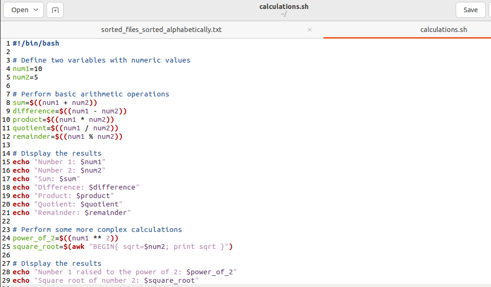
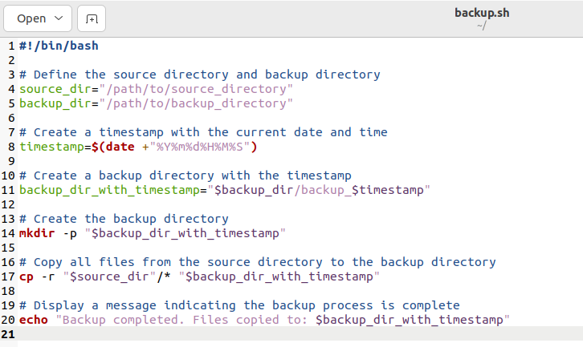

# Documentation for SHELL SCRIPTING

- Introduction to Shell Scripting and User Input.

In our previous git project, if we want to clone a git repo, we simple type the command **`git clone`** and pass in the link to the repository.

Also, if we are given a task to clone 1000 repositories, we can also use the **`git clone`** command 1000 times. But note this method requires 

alot of patience to complete the task. This is where shell scripting  helps in automating repetitive task by simply just writing a script that 

does the job of cloning all 1000 repositories at once. We have the advantage of using it again whenever we are assigned the same task.

Bash scripts essentially are series of commands and instructions executed sequentially in a shell environment. You can create a shell script 

by saving collection of commands in a text file using the **`.sh`** extension. Note, this scripts can be executed directly from the 

command line or called from other scripts.

## Shell Scripting Syntax Elements

- Variables: You can define and workwith variables by storing data of various types such as numbers, strings and arrays. 

You can assign values to the variables using the **`=`** operator and access their values using the variable name preceded by a **`$`** sign.

Example: Assigning value to a **`variable`** and Retrieving value from the **`variable`**

- Control Flow: There are control flow statements like **`if-else`**, **`for loops`**, **`while loops`** and **`case statements`** 

to control the flow of execution in your scripts. These statements allows you to make decisions, iterate over lists and execute 

different commands based on conditions.

Example: Using the **`if-else`** to execute script based on a condition

In the example below we going to run a script to check if a number is positive, negative, or zero

Example: Using the **`for loop`** to iterate through a list

In this example script we going to print numbers from 1 to 5 using a **`for loop`**

- Command Substitution: Allows you to capture the output of a command and use it as a value within your script. 

Note: you can use the **`$()`** syntax for command substitution.

Example below using the **`$()`** syntax for command substitution

- Input and Output: Bash provides various ways to handle input and output. You literally use the **`read`** command to accept user input, and

output text to the console using the **`echo`** command. Also, you can redirect input from a file using **`<`** , output to a file using

**`>`** and **`|`** (pipe the output of one command as input to another).

Now lets try out some examples below:

Example: Accept user input

Example: Output text to the terminal

Example: Output the result of a command into a file

First you will need to create a txt file using the **`touch index.txt`** 

then type the following the code below:

Use the **`cat`** command to print output in the text file.

Example: Pass the content of a file as input to a command

In the screenshot below you can see no output was displayed, this because the command **`grep "pattern"`** is not found in the **`< input.txt`** file 

which is empty.

Example: Pass the result of a command as input to another command

In the screenshot below you can see the first command didnt produce any output, because the **`grep "pattern"`** is not included 

in the **`echo "Hello world"`** but see the second command after changing to **`grep "world"`** and it fully displayed the echo message.

- Functions: Bash function allows you to define and group related commands together and also a provides a way to modularize code and

 make it more reusable. Functions are define using the function keyword or simply by declaring the function name followed by parentheses. 

An example below is a function to greet a user and call the greet function and pass the name as an argument.

## Lets write out First Shell Script

- Step 1: On the terminal create a folder called using the command **`mkdir shell-scripting`**

- Step 2: Create a file called **`user-input.sh`** using the command **`touch user-input.sh`**

- Step 3: Inside the file copy and paste the block of code below:

- Step 4: Save the file

- Step 5: Then run the command **`sudo chmod +x user-input.sh`** to make the file executable.

- Step 6: Run the script using the command **`./user-input.sh`**

## Directory Manipulation and Navigation

In this script exercise we going to display the current directory, create a new directory and called it **`my_directory`**, change to

that directory, create two files inside it, list the files, move back one level up, remove the **`my_directory`** and its contents, and

finally list the files in the current directory again.

- Step 1: Create a file and name it **`navigating-linux-filesystem.sh`**

- Step 2: Paste this code block below into the file created above and save.

- Step 3: Run the command **`sudo chmod +x navigating-linux-filesystem.sh`** to execute the permission on the file

- Step 4: Run the script now using the command **`./navigating-linux-filesystem.sh`**

## File Operations and Sorting

In this exercise we will write a simple shell script that emphasis on **`File Operations and Sorting`**.

We will create three script (**`file1.txt, file2.txt & file3.txt`**), we now display the files in current order, sort them alphabetically

save the sorted files in sorted_files.txt, display the sorted files, remove the original files, now rename the sorted file to 

**`sorted_files_sorted_alphabetically.txt`** and finally display the contents of the final sorted file.

- Step 1: Create a file in the terminal called **`sorting.sh`** using the command **`touch sorting.sh`**

- Step 2: Copy and paste the code block below into the file created.

- Step 3: Execute permission on sorting.sh using the command **`sudo chmod +x sorting.sh`**

- Step 4: Run the script using the command **`./sorting.sh`**

Final result of sorted file

## Working with Numbers and Calculations

This script defines two variables **`num1`** and **`num2`** with numeric values, performs basic arithmetic operations 

(addition, subtraction, multiplication, divison, and modulus), and display the results. It also performs more complex calculations

such as raising **`num1 to the power of 2`** and calculating the **`square root of num2`** and displays those results as well.

- Step 1: On the terminal create a file called **`calculations.sh`** using the command **`touch calculations.sh`**

- Step 2: Copy and paste the code block below:

- Step 3: Execute the permission on **`calculations.sh`** using the command: **`sudo chmod +x calculations.sh`**

- Step 4: Run the script using this command: **`./calculations.sh`**

Output commands displayed below:

## File Backup and Timestamping

This script defines the source directory and backup directory paths. It then creates a timestamp using the current date and time,

and creates a backup directory with the timestamp appended to its name. The script then copies all files from the source directory 

to the backup directory using the **`cp`** command with the **`-r`** option for recursive copying. Finally, it displays a message

indicating the completion of the backup process and shows the path of the backup directory with the timestamp.

Now lets proceed with this steps below:

- Step 1: On your terminal create a file **`touch backup.sh`**

- Step 2: Copy and paste the code block below into the file.

## NOTE BELOW: 

Remember, i will create a folder  **`mkdir testing`** and create 3 files in the folder, which are **`file1.txt, file2.txt & file3.txt`**. 

This files would be contents that i will use has backup to the **`backup_dir`** directory of any choice, in this case i will 

choose **`Documents`** folder.

## Edit the backup.sh file

- Now, change the **`source_dir=" /path/to/source_directory"`** to where you have the folder **`testing`**

- Also, change the **`backup_dir="/path/to/backup_directory"`** to where you want to back the files in this case 

i will be backing it up in my **`Documents Folder`**.

- Step 3: Execute permission on **`backup.sh`** using the command **`sudo chmod +x backup.sh`**

- Step 4: Run the script using the command: **`./backup.sh`**

Note the file1.txt, file2.txt and file3.txt below  backedup in the Documents Folder.

# THANK YOU

