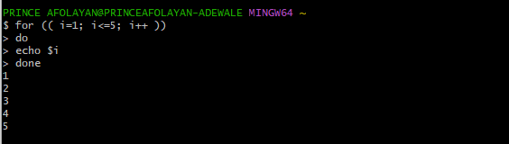

# Documentation for SHELL SCRIPTING

- Introduction to Shell Scripting and User Input.

In our previous git project, if we want to clone a git repo, we simple type the command **`git clone`** and pass in the link to the repository.

Also, if we are given a task to clone 1000 repositories, we can also use the **`git clone`** command 1000 times. But note this method requires 

alot of patience to complete the task. This is where shell scripting  helps in automating repetitive task by simply just writing a script that 

does the job of cloning all 1000 repositories at once. We have the advantage of using it again whenever we are assigned the same task.

Bash scripts essentially are series of commands and instructions executed sequentially in a shell environment. You can create a shell script 

by saving collection of commands in a text file using the **`.sh`** extension. Note, this scripts can be executed directly from the 

command line or called from other scripts.

## Shell Scripting Syntax Elements

- Variables: You can define and workwith variables by storing data of various types such as numbers, strings and arrays. 

You can assign values to the variables using the **`=`** operator and access their values using the variable name preceded by a **`$`** sign.

Example: Assigning value to a **`variable`** and Retrieving value from the **`variable`**

- Control Flow: There are control flow statements like **`if-else`**, **`for loops`**, **`while loops`** and **`case statements`** 

to control the flow of execution in your scripts. These statements allows you to make decisions, iterate over lists and execute 

different commands based on conditions.

Example: Using the **`if-else`** to execute script based on a condition

In the example below we going to run a script to check if a number is positive, negative, or zero

Example: Using the **`for loop`** to iterate through a list

In this example script we going to print numbers from 1 to 5 using a **`for loop`**

- Command Substitution: Allows you to capture the output of a command and use it as a value within your script. 

Note: you can use the **`$()`** syntax for command substitution.

Example below using the **`$()`** syntax for command substitution

- Input and Output: Bash provides various ways to handle input and output. You literally use the **`read`** command to accept user input, and

output text to the console using the **`echo`** command. Also, you can redirect input from a file using **`<`** , output to a file using

**`>`** and **`|`** (pipe the output of one command as input to another).

Now lets try out some examples below:

Example: Accept user input

Example: Output text to the terminal

Example: Output the result of a command into a file

First you will need to create a txt file using the **`touch index.txt`** 

then type the following the code below:

Use the **`cat`** command to print output in the text file.

Example: Pass the content of a file as input to a command

In the screenshot below you can see no output was displayed, this because the command **`grep "pattern"`** is not found in the **`< input.txt`** file 

which is empty.

Example: Pass the result of a command as input to another command

In the screenshot below you can see the first command didnt produce any output, because the **`grep "pattern"`** is not included 

in the **`echo "Hello world"`** but see the second command after changing to **`grep "world"`** and it fully displayed the echo message.

- Functions: Bash function allows you to define and group related commands together and also a provides a way to modularize code and

 make it more reusable. Functions are define using the function keyword or simply by declaring the function name followed by parentheses. 

An example below is a function to greet a user and call the greet function and pass the name as an argument.

## Lets write out First Shell Script

- Step 1: On the terminal create a folder called using the command **`mkdir shell-scripting`**

- Step 2: Create a file called **`user-input.sh`** using the command **`touch user-input.sh`**

- Step 3: Inside the file copy and paste the block of code below:

- Step 4: Save the file

- Step 5: Then run the command **`sudo chmod +x user-input.sh`** to make the file executable.

- Step 6: Run the script using the command **`./user-input.sh`**

## Directory Manipulation and Navigation

In this script exercise we going to display the current directory, create a new directory and called it **`my_directory`**, change to

that directory, create two files inside it, list the files, move back one level up, remove the **`my_directory`** and its contents, and

finally list the files in the current directory again.

- Step 1: Create a file and name it **`navigating-linux-filesystem.sh`**

- Step 2: Paste this code block below into the file created above and save.

- Step 3: Run the command **`sudo chmod +x navigating-linux-filesystem.sh`** to execute the permission on the file

- Step 4: Run the script now using the command **`./navigating-linux-filesystem.sh`**

## File Operations and Sorting

In this exercise we will write a simple shell script that emphasis on **`File Operations and Sorting`**.

We will create three script (**`file1.txt, file2.txt & file3.txt`**), we now display the files in current order, sort them alphabetically

save the sorted files in sorted_files.txt, display the sorted files, remove the original files, now rename the sorted file to 

**`sorted_files_sorted_alphabetically.txt`** and finally display the contents of the final sorted file.

- Step 1: Create a file in the terminal called **`sorting.sh`** using the command **`touch sorting.sh`**

- Step 2: Copy and paste the code block below into the file created.

- Step 3: Execute permission on sorting.sh using the command **`sudo chmod +x sorting.sh`**

- Step 4: Run the script using the command **`./sorting.sh`**

Final result of sorted file

## Types of Technology stack

- LAMP (Linux, Apache, MySQL, PHP or Python, or Perl)

- LEMP (Linux, Nginx, MySQL, PHP or Python, or Perl)

- MERN (MongoDB, ExpressJS, ReactJS, NodeJS)

- MEAN (MongoDB, ExpressJS, AngularJS, NodeJS)

Below we will create an EC2 instance, connect into it and establish a connection.

## STEPS IN CREATING AN EC2 INSTANCE

- Step 1:

Type ec2 on the search field

- Step 2

Click the launch instance highlighted in orange

- Step 3

Give your instance a name

- Step 4

Select the Ubuntu AMI Image and make sure is the free tier enabled so you dont incur costs

- Step 5

Create a key Pair, this will enabled you to securely SSH into the Ubuntu Machine. And the pem format should be selected.

- Step 6

Select the key pair you just created from the drop down menu.

- Step 7

For now select the default Security Group option from the Drop down menu.

- Step 8

Hit the Launch button

- Step 9

EC2 Instance launched successfully

- Step 10

Refresh the instance after initializing

- Step 11

Now on the far right corner click on connect to SSH into our Ubuntu Machine.

- Step 12

Select the SSH client option

- Step 13

Copy the ssh -i command full path address

- Step 14

But first remember when we created the key pair it was saved into downloads, to proceed we need to change directory to Downloads and paste the ssh - command full path

address into the terminal.

- Step 15

It will ask you to confirm Yes or Y, either will work by typing in the terminal Yes or Y.

- Step 16

Holla!!! You are now inside the Ubuntu AMI Machine.

## Installing Apache and Updating the Firewall

What is Apache:

Apache is an open source software available for free. It runs on 67% of all webservers in the world. It is fast, reliable, and secure.

Most WordPress hosting providers use Apache as their web server software.

Now, we going to install Apache using Ubuntu's package

manager **`apt`**:

so going back to the EC2 instance we created, remember we stopped it, now we going to start it to so has to enter into the ubuntu machine and install Apache.

After successfully starting the EC2 instance, SSH into the machine and run the command below:

 **`sudo apt update`**
 **`run apache2 package installation`**
 **`$ sudo apt install apache2`**

But first we need to update a list of packages in package manager with the command below:

- To Update a list of packages

- Run apache2 package installation

To verify that apache2 is running as a service, use the following command below:

**`sudo systemctl status apache2`**

From the above image all status green and running, which indicates everything is running correctly.

But before we can recieve any traffic, we need to open TCP port 22 on the EC2 instance and SSH into it.

And add a rule to EC2 configuration to open inbound connection through port 80:

- Below are the steps and configuration:

Step 1:

Click on the security group tab option

Step 2:

Click on the edit inbound rule on the right

Step 3:

Edit all parameters and save rules

Step 4:

Inbound rules edited succesfully

Step 5:

Now lets check if we can acess it on our Ubuntu shell.

Now, that all settings and configurations are implemented, and server is running we can access it locally from the internet.

To do that lets run it locally on the Ubuntu shell

**`$ curl http://localhost:80`** and **`$ curl http://127.0.0.1:80`**

Both command practically does the same thing, the first try to access the server via DNS name and the second one by IP address.

Step 6:

Copy the ipv4 address and paste it on the local web browser of our machine.

# Note

- The curl is a tool for transferring data from or to a server using URLs. It supports these protocols: DICT,

FILE, FTP, FTPS, GOPHER, GOPHERS, HHTP, HTTPS, IMAP etc. Now, to fully test how the Apache HTTP server can

respond to request from the internet. On the web browser type this in url.

Below is the output:

Same content got by **`curl`** command in the terminal, but the other is nicely presented in **`HTML`**`

format on the web browser.

Step 7:

Holla!!! Apache works

### INSTALLING Mysql

Now, that our web server up and running, we need to install Database Management System (DBMS) to be able to store and manage data

for the website in relational database.

Now, to install mysql. We run the command below on the terminal:

**`$ sudo apt install mysql-server`**

When prompted, confirm installation by typing **`Y`**`for Yes and hit **`Enter`**

After successful installation, log into the MySql with the command below:

**`$ sudo mysql`**

This command above literally connects to the Mysql server as the administrative database user **`root`**

In moving forward, its recommended we run a security script that comes pre-installed with MySQL. The purpose of this script is to remove insecure default settings and

lock down access to the database system. In doing this we going to run the code below:

**`ALTER USER`root`@`localhost` IDENTIFIED WITH mysql_native_password BY `PassWord.1`;`**

After inserting the code, Exit the MySQL shell.

Now, start the interactive script above by running:

**`$ sudo mysql_secure_installation`**

This will ask if you want to configure the **`VALIDATE PASSWORD PLUGIN`**

The screenshot below follows the steps in doing this.

SCREENSHOT 1

SCREENSHOT 2

SCREENSHOT 3

Afterall this, we going to test if we are able to log in to the MySql console by typing:

**`$ sudo mysql -p`**

- Note that the -p flag in this command is used to prompt you for the password used after changing the

**`root`** user.

Now, MySQL server is now installed and secured.

## Installing PHP

Having installed Apache to serve the content and MySQL to store and manage data. We going to delve into PHP which is used to display dynamic content to the end user.

We wiil need to install the **`php`** package, and **`php-mysql`** which is a PHP module that allows PHP to communicate

with MySQL-based databases. Also we will need  **`libapache2-mod-php`** to enable Apache to handle PHP files.

Note, Core PHP packages will utomatically be installed as dependencies.

- ALL COMMANDS CAN BE RUN AT ONCE WITH THE FOLLOWING COMMANDS BELOW:

**`$ sudo apt install php libapache2-mod-php php-mysql`**

After successful installation we can check the PHP Version installed with the command below:

**`php -v`**

At this point, the full LAMP (Linux, Apache, MySql & Php) is completely installed and fully operational.

To test the setup with a PHP script, its best to set up a proper **`Apache Virtual Host`** to hold website`s files and folders.

The main reason behind this logic is, **`Virtual host`** allows you to have multiple websites located on a single machine.

- To configure our first Virtual Host, note the default **`Directory Index`** settings on Apache, a file named **`index.html`** will always take precedence over an

**`index.php`** file.

To do this we edit the **`/etc/apache2/mods-enabled/dir.conf`** file and change the order in which the **`index.php`** file is listed within the **`Directory Index`**

directive. To do this run the command below:

**`sudo vim /etc/apache2/mods-enabled/dir.conf`**

This command opens up the vim for you to edit the file.

Initial File Before Edit

File after Edit

Edit this on the DirectoryIndex **`index.php index.html index.cgi index.pl index.xhtml index.htm`** after you save and close the file on **`VIM`**,

by pressing the **`Esc key`**, Press **`:(colon)`** to open he prompt bar in the bottom left corner of the window. Type **`x`** after the **`colon`** and hit

**`Enter`**. This will save the changes and exit. Then reload Apache so the changes can take effect:

With this command **`$ sudo systemctl reload apache2`**

Note that we have custom location to host our website's files and folders, we will create a PHP test script to confirm that Apache is able to

handle and process requests for PHP files. We will create a new file named **`index.php`** inside the custom web root folder below:

**`$ vim /var/www/projectlamp/index.php`**. This will open a blank file, insert this into the blank file

**`<?php
phpinfo();`**

After doing this save and close the file and refresh the page and below is the output:

Note, the primary purpose of this output above, is useful for debugging and to ensure that your setttings are applied correctly.

It's also best to remove the page you created as it contains sensitive information about the PHP environment and the Ubuntu Server.

 By doing this we apply the following command:

 **`$ sudo rm /var/www/projectlamp/index.php`**

## Creating a Virtual Host for your Website using Apache

We will set up a domain called **'projectlamp'** and create a directory for **`projectlamp`** using **`mkdir`** command as follows:

**`sudo mkdir /var/www/projectlamp`**

Next step is to assign ownership of the directory with your current system user:

**'sudo chown -R $USER:$USER /var/www/newproject'**

Then open and create a new configuration filein apache using the **'vi'** or **'vim'** line editor, this creates a new blank file.

By hitting the **`i`** for insert button on the keyboard paste the following text below:

**`<VirtualHost *:80>`**

**`ServerName newproject`**

**`ServerAlias <www.newproject>`**

**`ServerAdmin webmaster@localhost`**

**`DocumentRoot /var/www/newproject`**

**`ErrorLog ${APACHE_LOG_DIR}/error.log`**

**`CustomLog ${APACHE_LOG_DIR}/access.log combined`**

**`</VirtualHost>`**

Now use a2ensite command to enable the new virtual host:

**`sudo a2ensite newproject`**

To disable Apache default website use **`sudo a2dissite 000-default`**

To make sure the configuration file doesnt contain any syntax errors, run the command below: **`sudo apache2ctl configtest`**.

Now Reload Apache so these following changes take effect

**`sudo systemctl reload apache2`**

# THANK YOU
