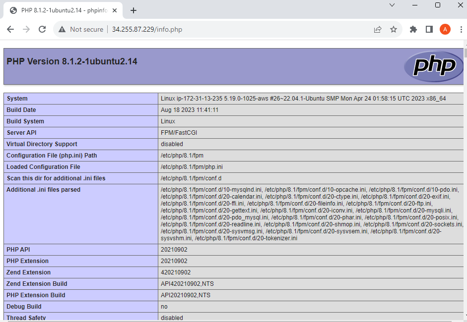

# Documentation For WEB STACK IMPLEMENTATION

This Project shows how to build and deploy web applications using the LEMP stack. It emphasis on creating dynamic and high-performing 

websites by combining Linux, Nginx, MySQL, and PHP.

Note, in the previous deployment of LAMP stack we used Putty on Windows to connect into our EC2 instance, now we going to introduce 

another method using the Git Bash erminal and SSH into it and see if it works. But first we going to create an EC2 instance, following this link to 

see the steps in creating an instance **`https://github.com/DevopsAde/Devops_Project/tree/main/LAMP%20STACK`**

Now that i have my EC2 instance created, always remember to copy this command to connect, below is the output:

NOTE: Always **`cd`** change directory into where your keypair was downloaded or you will encounter an error, in this case mine is **`cd Downloads`**

Below is the output using the Git Bash:

## Installing the Nginx Web Server

To display web pages we going to install Nginx, a high performance web server. Using the command **`apt update`** package manager

 to install this package, then finally use **`apt install`** to get Nginx installed.

**`sudo apt update`** installed 113 packages

**`sudo apt install nginx`**

To verify the status of nginx installation if everything is okay, HOLLA!!! ACTIVE AND RUNNING SUCCESSFULLY.

Now, that we have launched our first Web Server into the clouds, to receive any traffic we need to open TCP port 80 

which is a default port for web browsers to access web pages on the internet. Note, TCP port 22 is open by default on 

the EC2 instance via SSH. The latter is used to open inbound connection.  

Click on security and click on edit inbound rules on the far right and input the details below and save rules.

Also, note the **`0.0.0.0/0`** means any IP Address can access it from anywhere.

Lets check it locally on our Ubuntu shell machine and run the command below:

**`$ curl http://localhost:80`** or **`curl http://127.0.0.1:80`** both display same outputs.

Now for the finally part lets check our Nginx server can respond to requests from the internet. 

using the Public IPv4 address which in this case is **`34.255.87.229`**

### Hurray!!! Nginx Server Works

## INSTALLING MYSQL

We Previously have our Nginx Web Server up and running, now we need to install the Database Management System (DBMS) 

to store and manage data for the site in a relational database.

Using this command we installed Mysql **`sudo apt install mysql-server`**

When Prompted during installation Type **`Y`** and Hit **`Enter`**

Download in Progress

After successful installation, lets login to the Mysql console with this command

**`sudo mysql`** this command connect to the MySQL server as the administrative database user root. Output below:

Moving forward we have to run a security script that comes pre-installed with Mysql. The purpose of this script is to remove 

insecure default settings and lock down access to the database system. But before we proceed we set a password for the root user

using **`mysql_native_password`** as a default authentication method. In this setting we define the user password as **`PassWord.1`**

Now, what follows is to start the interactive script with this commands below and steps:

Now, lets see if we can login to the MySQL console by using this command **`sudo mysql -p`** note the **`-p`** flag is used to prompt 

for the password used after the changing the **`root`** user password **`PassWord.1`**

Hurray!!! what this means is that password was set, and changed successfully.

Now that my Mysql server is set up and running we move to the setting up and installing PHP.

## Installing PHP

Now that we have Nginx installed to serve content and Mysql installed to store and manage data. We now have to install PHP to process code 

and generate dynamic content for the web server. Now to note the difference **`APACHE`**` embeds the PHP interpreter in each request, 

**`NGINX`** requires an external program to handle PHP processing which act as a bridge between the PHP interpreter and the web server. 

We need to install **`php-fpm`** which stands for **`PHP FastCGI process manager`**, this tells Nginx to pass PHP requests to this software for 

processing. Also, we will need **`php-mysql`**, a PHP module that allows PHP to communicate with Mysql-based Databases.

We need to install this 2 packages at once, command below:

**`sudo apt install php-fpm php-mysql`**

When Prompted enter **`Y`** and Hit **`Enter`**

Successful Download in Progress

Now that we have the PHP components installed we now have to configure Nginx to use them.

## Configuring Nginx to Use PHP Processor

In this configuration, using Nginx web server we would create server blocks similar to virtual hosts in Apache to encapsulate 

the configuration details and host more than one domain on a single server. We will use **`projectLEMP`** in this example has the domain name.

NOTE: By default Nginx has one server block enabled by default and its configured to serve documents out of a directory at **`/var/www/html`**. 

This works for a single site, also it can be difficult to manage if you want to host multiple sites. 

So, instead of modifying **`/var/www/html`**, we will create a directory structure within **`/var/www`** for the **`domain`** website leaving 

**`/var/www/html`** as the default directory to served for a client whose request does not match any other sites.

Now we going to Create the root web directory for **`your_domain`** in this case its **`projectLEMP`**.

**`sudo mkdir /var/www/projectLEMP`**

Next is to assign ownership of the directory with the **`$USER`** environment variable, which in this case represent your current system user.

**`sudo chown -R $USER:$USER /var/www/projectLEMP`**

Next is to open a new configuration file using **`nano`** with the command below: **`sudo nano /etc/nginx/sites-available/projectLEMP`** this 

automatically creates a new blank file.

Paste the following code inside the nano editor press **`ctrl and X`** and hit **`Y`** and **`Enter`**

In the above command, we going to give a brief definition of what each directives and location blocks do.

- **`Listen`**: In this case, Nginx will listen to **`port 80`**, the default port for **`HTTP`**.

- **`root`**: In the root document this where files on the websites are stored.

- **`index`**: This Define in which order Nginx will prioritize index files for the website. Always note that its a common a practice

 to list **`index.html`** files with a higher precedence than **`index.php`** files to allow for quickly setting up a maintenance 
 
 landing page in PHP applications.

- **`server_name`**: Domain names or IP address the server block should respond, Always remember to pint this directive to the server's 

domain name or public IP address.

- **`location /`**: This first location block includes a **`try_files`** directive, which checks for the files or directories matching a URL request. 

In this case, if Nginx cannot find the appropriate resource, it returns a **`404 error`**

- **`location ~ /\.ht`**: The last location block deals with **`.htaccess`** files, which Nginx does not process. 

By adding the deny all directive, if any **`.htaccess`** files happen to find their way into the document roor, they will not be served to visitors.

- **`location ~\.php$`**: Location block handles the actual PHP process by pointing Nginx to the **`fastcgi-php.conf`** configuration

file and the **`php7.4-fpm.sock file`** which declares what socket is associated with **`php-fpm`**

Now to activate all the configuration by linking to the config file from Nginx **`sites-enabled`** directory. Run the command below:

**`sudo ln -s /etc/nginx/sites-available/projectLEMP /etc/nginx/sites-enabled/`**
 
Also to check or test your configuration for syntax errors used the command **`sudo nginx -t`**

If you detect any errors, kindly go back to the configuration file to review its content.

We also need to disable default Nginx host currently configured to listen on **`port 80`**. Run this command:

**`sudo unlink /etc/nginx/sites-enabled/default`**

After applying the command, reload Nginx to apply the changes **`sudo systemctl reload nginx`**

Our new website is now active, but the web root **`/var/www/projectLEMP`** is still empty. We now have to create an index.html file in 

that location and test the new server block works. Do this by insert the following command on the Git Bash terminal:

## Hurray!!!! It works. 

You see the text from the **`echo`** command i wrote to the index.html file, it basically means the Nginx site is working efficiently.

LEMP stack is fully configured. Next we create a PHP script to test that Nginx can handle **`.php`** files with websites

## Testing PHP with Nginx

To test and validate that Nginx can efficiently take in **`.php`** files to the PHP processor. We will create a test PHP file 

in the document root. Using the **`nano`** text editor, open a new file and name it **`info.php`** within the document root in the 

text editor using this command below:

**`nano /var/www/projectLEMP/info.php`**

Then paste this in the nano editor below:

Now lets access this page in the web browser by visiting the Domain or public IP Address we just configured in the Nginx configuration

file, followed by the **`/info.php`**. The command below executes this:

**`http://server_domain_or_IP/info.php`** 

Note: In this case its my **`public address`** on my EC2 instance followed by the **`/info.php`**.

Its best practice to remove the file you created as it contains sensitive information about your PHP environment and your ubuntu server. 

Use the following command below:

**`sudo rm /var/www/public_address/info.php`**

## Retrieving Data from MySQL Database with PHP

In this example we will create a test databse (DB) with simple **`To do list`** and configure access to it, to enable Nginx 

website query data from the DB and display it. We will now create a new user with the **`mysql_native_password`** authentication 

method in order to be able to connect to the MySQL database from PHP.

Now lets create a database **`example_database`** and a user named **`example_user`**. First step, is to connect to the MySQL

console using the root account: **`sudo mysql`** but in this case remember in the previous configuration we set up a password 
 
for the mysql database, so we instead we use the command **`sudo mysql -p`**, **`-p`** stands for the password set.

To create a new Database, insert the following code into the terminal: **`CREATE DATABASE`** `train_database`; in this case i changed 

the name of the databse to train_database. 

NOTE: The name of your database is case sensitive advice using a lower case just like the 

example above or you will encounter an error.

In moving forward we going to create a new user and grant him full privileges on the database we have just created.

The command below creates a new user named **`example_user`**, remember using mysql_native_password as default 

authentication method. We are defining this user's password as **`Password.1`**.

**`CREATE USER 'example_user'@'%' IDENTIFIED WITH mysql_native_password BY 'Password.1';`**

Now, we give the user permission over the **`example_user`** database. We grant his with the following command: 

**`GRANT ALL ON train_database.* TO 'example_user'@'%';`**

What this means in general is we giving the **`example_user`** user full privilege over the **`train_database`**, while 

preventing this user from creating or modifying other databases on the server. After, type **`exit`** and hit **`Enter`**.